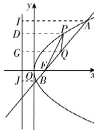

> [!faq]- 答案与解析
>
> > [!success]- **【答案】** 6
>
> > [!note]- **【解析】**
> > 如图所示,分别过 A, B, P, Q 四点向准线 $x = -\frac{p}{2}$ 作垂线, 垂足分别为 I, J, D, G, 设 A, B, P, Q 的横坐标分别为 $x_{A}, x_{B}, x_{P}$ ,
> >
> > 
> >
> > $x_{Q}$ ，由抛物线的定义及梯形中位线的性质可知， $\vert AI\vert = \vert FA\vert = x_A + \frac{p}{2},\vert BJ\vert =$ $|FB| = x_B + \frac{p}{2},\vert PD| = \vert PF| = x_P + \frac{p}{2},$ $|QG| = \frac{|AI| + |BJ|}{2} = \frac{|AF| + |BF|}{2} =$ $\frac{x_A + x_B + p}{2},$ 易知 $\vert PF\vert +\vert PQ\vert = \vert PD\vert +\vert PQ\vert \geqslant$ $|QG| = \frac{x_A + x_B + p}{2}$ ，当且仅当 $G,P,Q$ 三点共线，且 $P$ 在线段 $GQ$ 上时，等号成立.设直线 $AB:x = my + \frac{p}{2},A(x_A,y_A),$ $B(x_{B},y_{B})$ ，联立直线 $AB$ 与抛物线的方程得 $y^{2} - 2pmy - p^{2} = 0$ ，所以 $y_{A}y_{B} =$ $-p^2$ ，则 $x_{A}x_{B} = \frac{y_{A}^{2}y_{B}^{2}}{2p\cdot 2p} = \frac{p^{2}}{4}$ ，则由基本不等式可知 $\sqrt{x_Ax_B} = \frac{p}{2}\leqslant \frac{x_A + x_B}{2}$ ，当且仅当 $x_{A} = x_{B} = \frac{p}{2}$ 时等号成立，则 $\frac{x_A + x_B + p}{2}\geqslant \frac{p}{2} +\frac{p}{2} = p,$ 又 $|\mathit{PF}| + |\mathit{PQ}|$ 的最小值为6，故 $p = 6.$
