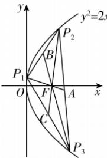

> [!faq]- 答案与解析
>
> > [!success]- **【答案】** A
>
> > [!note]- **【解析】**
> > A 【解析】依题意知 $F\left(\frac{1}{2},0\right)$ ，设 $P_{1}(x_{1},y_{1}), P_{2}(x_{2},y_{2}), P_{3}(x_{3},y_{3})$ ，因为 F 为 $\triangle P_{1}P_{2}P_{3}$ 的重心，所以 $\frac{x_{1}+x_{2}+x_{3}}{3}=\frac{1}{2}$ ，即 $x_{1}+x_{2}+x_{3}=\frac{3}{2}$ .
> >
> > 点悟：若 $\triangle ABC$ 的重心为 $F(x,y)$ ，则 $x=\frac{x_{A}+x_{B}+x_{C}}{3}, y=\frac{y_{A}+y_{B}+y_{C}}{3}$ 设线段 $P_{2}P_{3}, P_{1}P_{2}, P_{1}P_{3}$ 的中点分别为 A, B, C.
> >
> > 由抛物线的定义可知 $|P_{1}F|=x_{1}+\frac{1}{2}$ ，所以边 $P_{2}P_{3}$ 的中线长为 $|P_{1}A|=\frac{3}{2}|P_{1}F|=\frac{3}{2}\left(x_{1}+\frac{1}{2}\right)$ ,
> >
> > 同理可得边 $P_{1}P_{2}$ 和边 $P_{1}P_{3}$ 的中线长分别为 $\left|P_{3}B\right| = \frac{3}{2}\left|P_{3}F\right| = \frac{3}{2}\left(x_{3} + \frac{1}{2}\right)$ ， $\left|P_{2}C\right| = \frac{3}{2}\left|P_{2}F\right| = \frac{3}{2}\left(x_{2} + \frac{1}{2}\right).$ 所以 $\triangle P_{1}P_{2}P_{3}$ 三边中线长之和为 $\frac{3}{2}\left(x_{1} + x_{2} + x_{3} + \frac{3}{2}\right) = \frac{9}{2}$ . 故选A.
> >
> > 
