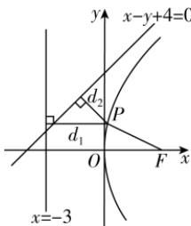

> [!faq]- 答案与解析
>
> > [!success]- **【答案】** A
>
> > [!note]- **【解析】**
> > A
> >
> > 思路导引 根据抛物线定义, 将点 P 到直线 x = -3 的距离转化为点 P 到焦点 F 的距离, 然后数形结合, 可以得出 $d_{1} + d_{2}$ 的最小值即为点 $F(3,0)$ 到直线 $x - y + 4 = 0$ 的距离, 再结合点到直线的距离公式即可求解.
> >
> > 【解析】由题意知，抛物线 $C: y^{2} = 12x$ 的焦点 $F(3,0)$ ，准线方程为 x = -3。因为点 P 在抛物线 $C: y^{2} = 12x$ 上，所以 $d_{1} = |PF|$ ，所以 $d_{1} + d_{2} = |PF| + d_{2}$ 。联立方程 $\left\{\begin{aligned}y^{2} &= 12x, \\ x - y + 4 &= 0,\end{aligned}\right.$ 得 $x^{2} - 4x + 16 = 0$ ，则 $\Delta = (-4)^{2} - 4 \times 16 = -48 < 0$ ，所以直线 x - y + 4 = 0 与抛物线 $C: y^{2} = 12x$ 无公共点。如图所示， $|PF| + d_{2}$ 的最小值即为点 $F(3,0)$ 到直线 x - y + 4 = 0 的距离，所以最小值为 $\frac{|3 - 0 + 4|}{\sqrt{2}} = \frac{7\sqrt{2}}{2}$ ，即 $d_{1} + d_{2}$ 的最小值为 $\frac{7\sqrt{2}}{2}$ 。故选 A。
> >
> > 
