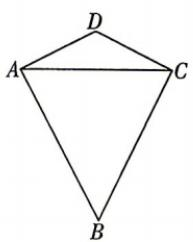
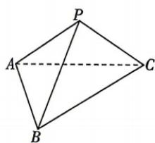

<!-- question-source:start -->
16. (本小题满分 15 分) [山西太原五中 2026 高二月考] 在平面四边形 ABCD 中, AD = CD = 2, AB = CB = $2\sqrt{3}$ , $\angle BAD = \angle BCD = 90^{\circ}$ (如图①), 将 $\triangle ACD$ 沿着 AC 翻折到 $\triangle ACP$ 的位置 (如图②), 且 $BP = \sqrt{10}$ .

(1) 求证: 平面 $ACP \perp$ 平面 ABC;

(2) 求平面 ABP 与平面 BCP 夹角的余弦值.

图①

图②
<!-- question-source:end -->

![[Q00072535A1]]
