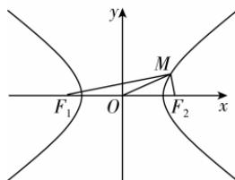

> [!faq]- 答案与解析
>
> > [!success]- **【答案】** A
>
> > [!note]- **【解析】**
> > A 【解析】不妨设点 $M$ 在双曲线的右系数的关系可得 $\left\{\begin{aligned}y_{1}+y_{2}&=\frac{-3t}{t^{2}+9},\\ y_{1}y_{2}&=\frac{-27}{4(t^{2}+9)}\end{aligned}\right.$ 记直线 $C^{\prime}D$ 与 x 轴的交点为 M，由对称性可知， $k_{CM} + k_{DM} = 0$ .
> > 设 $M(m,0)$ ，则有 $\frac{y_{1}}{x_{1}-m} + \frac{y_{2}}{x_{2}-m} = 0$ ，即 $y_{1}(x_{2}-m) + y_{2}(x_{1}-m) = 0$ .
> > 所以 $y_{1}(x_{2}-m)+y_{2}(x_{1}-m)=x_{1}y_{2}+x_{2}y_{1}-m(y_{1}+y_{2})=\left(ty_{1}+\frac{3}{2}\right)y_{2}+\left(ty_{2}+\frac{3}{2}\right)y_{1}-m(y_{1}+y_{2})=2ty_{1}y_{2}+\left(\frac{3}{2}-m\right)(y_{1}+y_{2})=2t\cdot\frac{-27}{4(t^{2}+9)}+\left(\frac{3}{2}-m\right)\cdot\frac{-3t}{t^{2}+9}=0$ ，即 $-9t+(3-2m)\cdot(-t)=0$ ，解得 m=6，所以直线 $C^{\prime}D$ 恒过定点 $M(6,0)$ .
> >
> > 名师点拨 得出 $ty_{1}y_{2}=\frac{9}{4}(y_{1}+y_{2})$ 再利用整体代换思想是解决①②的关键；根据对称性得出 $k_{CM} + k_{DM} = 0$ 是解决③的关键.
> >
> > 支上，如图所示. 设 $\left|MF_{1}\right|=m$ , $\left|MF_{2}\right|=n$ ，则 $\left\{\begin{aligned}m-n=2a①,\\ m^{2}+n^{2}=4c^{2}②,\\ \frac{1}{4}mn=\frac{a^{2}}{18}③,\end{aligned}\right.$ 由①得 $m^{2}+n^{2}-2mn=4a^{2}$ . 将②③代入即可得 $4c^{2}-\frac{4}{9}a^{2}=4a^{2}$ ,
> > 故 $4c^{2}=\frac{40}{9}a^{2}$ ，所以 $\frac{c^{2}}{a^{2}}=\frac{10}{9}$ ，
> > 所以离心率 $e=\frac{c}{a}=\frac{\sqrt{10}}{3}$ . 故选 A.
> >
> > 
