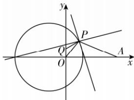

> [!faq]- 答案与解析
>
> > [!success]- **【答案】** B
>
> > [!note]- **【解析】**
> > B 【解析】直线 $l_{1}: kx - y + 2k + 4 = 0$ 过定点 $M(-2, 4)$ ，直线 $l_{2}: x + ky + 4k + 2 = 0$ 过定点 $N(-2, -4)$ ，且直线 $l_{1}$ 与直线 $l_{2}$ 垂直，所以点 P 的轨迹是以 MN 为直径的圆（除点 N），
> >
> > 避坑：几何法找轨迹时一定要排除不符合题意的点则该圆的圆心是 $(-2,0)$ ，半径为4，则点 $P$ 的轨迹方程是 $(x + 2)^{2} + y^{2} = 16(y\neq -4)$ ，令 $2|PO| = |PA|$ ，因为 $(x + 2)^{2} + y^{2} = 16$ 所以 $x^{2} + 4x + 4 + y^{2} = 16\Leftrightarrow 4x^{2} + 16x + 16+$
> >
> > $4y^{2}=64,x^{2}+4x+y^{2}=12,$ 则 $4x^{2}+4y^{2}=48-16x=36-16x+12=$ $36-12x+x^{2}+y^{2}$ ，所以 $2\sqrt{x^{2}+y^{2}}=\sqrt{(x-6)^{2}+y^{2}}$ ，可得点 A(6,0)，
> > 则 $2|PO|+|PQ|=|PA|+|PQ|\geqslant|AQ|=\sqrt{(0-6)^{2}+(1-0)^{2}}=\sqrt{37}$ ，此时点 P 是线段 QA 与圆 $(x+2)^{2}+y^{2}=16$ 的交点，点 P 存在，符合题意。故选 B.
> >
> > 
