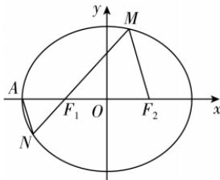

> [!faq]- 答案与解析
>
> > [!success]- **【答案】** A
>
> > [!note]- **【解析】**
> > A 【解析】因为椭圆 C 的离心率为 $\frac{1}{2}$ ，所以可设 a=2k, c=k(k>0)，故 b= $\sqrt{3}k$ ，因此椭圆 C 的方程为 $\frac{x^{2}}{4}+\frac{y^{2}}{3}=k^{2}$ .
> > 而 $\left|AF_{1}\right|=a-c=k,\left|F_{1}F_{2}\right|=2k$ ，故 $\frac{\left|AF_{1}\right|}{\left|F_{1}F_{2}\right|}=\frac{1}{2}$ ，因为 $MF_{2}//AN$ ，所以 $\frac{\left|NF_{1}\right|}{\left|MF_{1}\right|}=\frac{1}{2}$ 。因为直线 MN 与 x 轴不垂直也不重合，
> > 故可设 MN: x=my-k (m>0), M(x₁, y₁), N(x₂, y₂), 则 y₁=-2y₂.
> > 由 $\left\{\begin{aligned}&x=my-k,\\ &3x^{2}+4y^{2}=12k^{2}\end{aligned}\right.$ 可得 $(4+3m^{2})y^{2}-6mky-9k^{2}=0$ 因为 $F_{1}$ 在椭圆 C 的内部，所以 $\Delta>0$ 恒成立，且 $\left\{\begin{aligned}y_{1}+y_{2}&=\frac{6km}{4+3m^{2}},\\ y_{1}y_{2}&=\frac{-9k^{2}}{4+3m^{2}},\\ y_{1}&=-2y_{2},\end{aligned}\right.$ 故 $\frac{-6km}{4+3m^{2}}\cdot\frac{12km}{4+3m^{2}}=\frac{-9k^{2}}{4+3m^{2}}$ ，因为 $k\neq0$ ，
> > → 点 悟：将 $y_{1}=-2y_{2}$ 代入 $y_{1}+y_{2}=\frac{6km}{4+3m^{2}}$ ，得 $y_{1}=\frac{12km}{4+3m^{2}}, y_{2}=\frac{-6km}{4+3m^{2}}$ 所以 $m=\frac{2\sqrt{5}}{5}$ ,
> > 此时 $y_{1}=\frac{12k\times\frac{2\sqrt{5}}{5}}{4+\frac{12}{5}}=\frac{3\sqrt{5}}{4}k>0,$ $x_{1}=\frac{3\sqrt{5}}{4}k\times\frac{2\sqrt{5}}{5}-k=\frac{k}{2}>0,$ 故 M 在第一象限，符合条件，因此直线 MN 的斜率为 $\frac{1}{m}=\frac{\sqrt{5}}{2}$ . 故选 A.
> >
> > 
