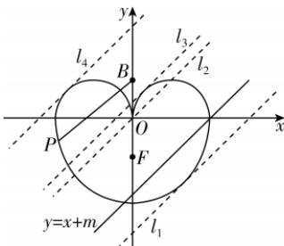

> [!faq]- 答案与解析
>
> > [!success]- **【答案】** ACD
>
> > [!note]- **【解析】**
> > ACD 【解析】 $C_{1}: y = \sqrt{-x^{2} + 2|x|}$ 可变形为 $(x \pm 1)^{2} + y^{2} = 1(y \geqslant 0)$ ，则上部
> >
> > 敲黑板：一定要注意y的取值范围
> >
> > 分曲线 $C_{1}$ 表示以点 $(\pm 1,0)$ 为圆心，1为半径的两个半圆.
> >
> > 对于选项A：曲线 $C_{2}: \frac{y^{2}}{a^{2}} + \frac{x^{2}}{b^{2}} = 1 (y \leqslant 0)$ 的一个焦点为 $F(0, -1)$ ，可得 $c = 1$ ， $b = 2$ ，则 $a = \sqrt{5}$ ，故曲线 $C_{2}$ 的方程为 $\frac{y^{2}}{5} + \frac{x^{2}}{4} = 1 (y \leqslant 0)$ ，故A正确；
> >
> > 对于选项B：设点 $B(0,1)$ ，则 $|PB|^{2} = x^{2} + (y - 1)^{2}$ ，当点P位于 $C_{2}$ 的下顶点，即 $P(0, -\sqrt{5})$ 时， $|PB|^{2} = (\sqrt{5} + 1)^{2} = 6 + 2\sqrt{5} > 1 + \sqrt{5}$ ，故B错误；
> >
> > 
> >
> > 对于选项 C: 当直线 $y = x + m$ 与 $C_{2}$ 相切时，联立方程 $\left\{\frac{x^{2}}{4} + \frac{y^{2}}{5} = 1\right.$ ，消去 y 可得 $9x^{2} + 8mx + 4m^{2} - 20 = 0$ ，令 $\Delta = 64m^{2} - 36(4m^{2} - 20) = 80(9 - m^{2}) = 0$ ，解得 m = 3（舍去）或 m = -3。取直线 $l_{1}: y = x - 3$ 和直线 $l_{2}: y = x$ 。若点 $(1, 0)$ 到直线 y = x + m，即 x - y + m = 0 的距离 $\frac{|1 + m|}{\sqrt{2}} = 1$ ，解得 $m = \sqrt{2} - 1$ 或 $m = -\sqrt{2} - 1$ （舍去）。若点 $(-1, 0)$ 到直线 y = x + m，即 x - y + m = 0 的距离 $\frac{|-1 + m|}{\sqrt{2}} = 1$ ，解得 $m = \sqrt{2} + 1$ 或 $m = -\sqrt{2} + 1$ （舍去），取直线 $l_{3}: y = x + \sqrt{2} - 1$ 和直线 $l_{4}: y = x + \sqrt{2} + 1$ 。以直线 $l_{1}, l_{2}, l_{3}, l_{4}$ 为临界，结合图形可知，若直线 y = x + m 与曲线 E 有 2 个交点，则 -3 < m < 0 或 $\sqrt{2} - 1 < m < \sqrt{2} + 1$ ，所以实数 m 的取值范围为 $(-3, 0) \cup (\sqrt{2} - 1, \sqrt{2} + 1)$ ，故 C 正确；对于选项 D：结合图形及上述分析可知,曲线 $C_{2}$ 上的点到直线 y=x-8 的距离的最小值即为直线 y=x-3 与直线 y=x-8 之间的距离,且两平行线间的距离为 $\frac{|-3+8|}{\sqrt{2}}=\frac{5\sqrt{2}}{2}$ , 所以曲线 $C_{2}$ 上的点到直线 y=x-8 的距离的最小值为 $\frac{5\sqrt{2}}{2}$ , 故 D 正确.
> >
> > 故选 **ACD**.
