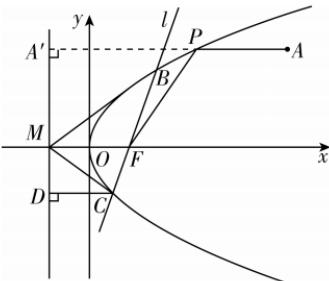

> [!faq]- 答案与解析
>
> > [!success]- **【答案】** ACD
>
> > [!note]- **【解析】**
> > ACD 【解析】对于 A, 根据题意画图, 如图所示, 由图知, 当且仅当直线 MB 与抛物线相切时, $\angle OMB$ 取得最大值.
> >
> > 
> >
> > 设直线 $MB$ 的方程为 $x = -1 + my$ ，联立 $\left\{ \begin{array}{l} y^2 = 4x, \\ x = -1 + my, \end{array} \right.$ 得 $y^2 - 4my + 4 = 0$ ，由 $\Delta = 16m^2 - 16 = 0$ ，得 $m = \pm 1$ ，此时直线 $MB$ 的斜率为 $\pm 1, \angle OMB = \frac{\pi}{4}$ ，因此 $\angle OMB$ 的最大值为 $\frac{\pi}{4}$ ，故 A 正确。对于 B，作点 $A(5,3)$ 在准线 $x = -1$ 上的射影 $A'(-1,3)$ ，设点 $P$ 到准线 $x = -1$ 的距离为 $d$ ，则 $|PA| + |PF| = |PA| + d \geqslant |AA'| = 6$ ，当且仅当 $A', P, A$ 三点共线时等号成立，故 B 错误。对于 C，由题意知， $M(-1,0), F(1,0)$ ，且直线 $l$ 的斜率不为 0，则设直线 $l$ 的方程为 $x = ny + 1, B(x_1, y_1), C(x_2, y_2)$ ，联立直线 $l$ 与抛物线方程 $\left\{ \begin{array}{l} y^2 = 4x, \\ x = ny + 1, \end{array} \right.$ 整理得 $y^2 - 4ny - 4 = 0$ ， $\Delta' = 16n^2 + 16 > 0$ ，则 $y_1 + y_2 = 4n, y_1y_2 = -4$ ，所以 $x_1 + x_2 = 4n^2 + 2, x_1x_2 = \frac{y_1^2y_2^2}{16} = 1$ ，则 $k_{MB} + k_{MC} = \frac{y_1}{x_1 + 1} + \frac{y_2}{x_2 + 1} = \frac{y_1(x_2 + 1) + y_2(x_1 + 1)}{(x_1 + 1)(x_2 + 1)} = \frac{2y_1 + 2y_2 + 2ny_1y_2}{x_1 + x_2 + x_1x_2 + 1} = \frac{2 \times 4n - 2n \times 4}{4n^2 + 2 + 1 + 1} = 0$ ，故直线 $MB, MC$ 的倾斜角互补，所以 $\angle OMB = \angle OMC$ ，故 C 正确。对于 D，由题意及选项 C 知 $D(-1, y_2), y_1 + y_2 = 4n, y_1y_2 = -4$ ，则 $k_{OB} = \frac{y_1}{x_1} = \frac{y_1}{\frac{y_1^2}{4}} = \frac{4}{y_1}, k_{OD} = -y_2,$ 由 $k_{OB} - k_{OD} = \frac{4}{y_1} + y_2 = \frac{4 + y_1y_2}{y_1} = 0$ ，知 $k_{OB} = k_{OD}$ ，即 $B,O,D$ 三点在同一条直线上，所以存在 $\lambda \in \mathbf{R}$ ，使得 $\overrightarrow{CO} = \lambda \overrightarrow{CD} +$ $(1 - \lambda)\overrightarrow{CB}$ ，故D正确.
> >
> > 故选 **ACD**.
