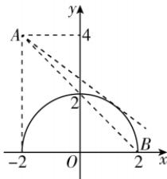

> [!faq]- 答案与解析
>
> > [!success]- **【答案】** $\left[-1,-\frac{3}{4}\right)$
>
> > [!note]- **【解析】**
> > 直线 $l:y=kx+2k+4$ 可化为 $(x+2)k-y+4=0$ ，所以直线 l 过定点 $A(-2,4)$ . $y=\sqrt{4-x^{2}}$ 可化为 $x^{2}+y^{2}=4(y\geqslant0)$ ，其表示以 $(0,0)$ 为圆心，2 为半径的圆在 x 轴及 x 轴上方的部分，当 l 与该曲线相切时，圆心 $(0,0)$ 到直线 l 的距离 $d=\frac{|4+2k|}{\sqrt{k^{2}+1}}=2$ ，解得 $k=-\frac{3}{4}$ .
> > 设 $B(2,0)$ ，则 $k_{AB}=\frac{4-0}{-2-2}=-1$ ，如图所示.
> >
> > 
> >
> > 由图可得,若要使直线 l 与曲线 $y=\sqrt{4-x^{2}}$ 有两个交点,则 $-1\leqslant k<-\frac{3}{4}$ ,
> > 即实数 k 的取值范围为 $\left[-1,-\frac{3}{4}\right)$ .
