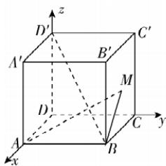

> [!faq]- 答案与解析
>
> > [!success]- **【答案】** $\sqrt{2}$
>
> > [!note]- **【解析】**
> > 连接 $BM$ ，如图，以 $D$ 为原点建立空间直角坐标系，则 $A(3,0,0), B(3,3,0), D'(0,0,3)$ ，设 $M(x,3,y)(x,y\in[0,3])$ 。则 $\overrightarrow{AM} = (x - 3,3,y), \overrightarrow{BD'} = (-3, -3,3)$ ，因为 $AM\perp BD'$ ，所以 $\overrightarrow{AM} \cdot \overrightarrow{BD'} = (x - 3,3,y) \cdot (-3, -3,3) = -3(x - 3) - 9 + 3y = 0$ ，所以 $y = x$ ，则 $M(x,3,x)$ 。因为 $AB\perp$ 平面 $BCC'B'$ ，所以 $\angle AMB$ 即为 $AM$ 与平面 $BCC'B'$ 所成的角，即 $\theta = \angle AMB$ ，则 $\tan \theta = \frac{AB}{BM} = \frac{3}{\sqrt{(x - 3)^2 + x^2}} = \frac{3}{\sqrt{2x^2 - 6x + 9}}$ ，所以当 $x = \frac{3}{2}$ 时， $\tan \theta$ 取得最大值 $\sqrt{2}$ 。
> >
> > 敲黑板： $y = 2x^2 - 6x + 9 = 2\left(x - \frac{3}{2}\right)^2 + \frac{9}{2}$ ，当 $x = \frac{3}{2}$ 时， $y$ 取最小值
> >
> > 
