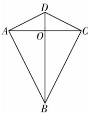
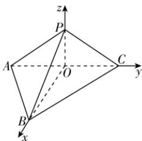

> [!faq]- 答案与解析
>
> > [!success]- **【答案】** (1)
>
> > [!note]- **【解析】**
> > 【证明】如图①,连接 BD 与 AC 交于点 O,
> >
> > 交于点 O，
> > 因为在平面四边形 ABCD 中，AD = CD = 2, AB = CB = $2\sqrt{3}$ ，所以 BD 垂直平分线段 AC, O 是 AC 的中点，所以 $BD \perp AC$ ，则在翻折后的图形中， $OP \perp$
> >
> > 
> > 图①
> >
> > $AC, OB \perp AC.$ 因为 $\angle BAD = \angle BCD = 90^{\circ}$ , 所以 $BD = \sqrt{BC^{2} + CD^{2}} = 4$ . 因为 $\sin \angle CBD = \frac{CD}{BD} = \frac{1}{2}$ , 所以 $\angle CBD = 30^{\circ}$ , 所以 $OB = BC \cdot \cos 30^{\circ} = 3, OD = 1$ . 翻折后, 因为 $OB^{2} + OP^{2} = 10 = BP^{2}$ , 所以 $OP \perp OB$ , 又 $OP \perp AC, OB \cap AC = O, OB, AC \subset$ 平面 $ABC$ , 所以 $OP \perp$ 平面 $ABC$ . 又 $OP \subset$ 平面 $ACP$ , 所以平面 $ACP \perp$ 平面 $ABC$ .
> >
> > 
> > 图②
> >
> > (2)【解】由(1)知, OB, OC, OP 两两垂直, 故以点 O 为坐标原点, 以 OB, OC, OP 所在直线分别为 x 轴, y 轴, z 轴建立如图②所示的空间直角坐标系, 则 $A(0, -\sqrt{3}, 0)$ , $B(3, 0, 0)$ , $C(0, \sqrt{3}, 0)$ , $P(0, 0, 1)$ ,
> > 所以 $\overrightarrow{PA}=(0,-\sqrt{3},-1),\overrightarrow{PB}=(3,0,-1),\overrightarrow{PC}=(0,\sqrt{3},-1)$ .
> > 设 $m=(x,y,z)$ 为平面 ABP 的法向量, 则 $\left\{\begin{aligned}&m\cdot\overrightarrow{PA}=-\sqrt{3}y-z=0,\\ &m\cdot\overrightarrow{PB}=3x-z=0,\end{aligned}\right.$ 令 z=3,
> > 得 $x=1,y=-\sqrt{3}$ ，所以 $m=(1,-\sqrt{3},3)$ . 设 $n=(a,b,c)$ 为平面 BCP 的法向量, 则 $\left\{\begin{aligned}&n\cdot\overrightarrow{PC}=\sqrt{3}b-c=0,\\ &n\cdot\overrightarrow{PB}=3a-c=0,\end{aligned}\right.$ 令 c=3, 得 $a=1,b=\sqrt{3}$ ，所以 $n=(1,\sqrt{3},3)$ .
> > 所以 $\cos\langle m,n\rangle=\frac{m\cdot n}{|m||n|}=\frac{1\times1-\sqrt{3}\times\sqrt{3}+3\times3}{\sqrt{13}\times\sqrt{13}}=\frac{7}{13}$ ，所以平面
> >
> > ABP 与平面 BCP 夹角的余弦值为 $\frac{7}{13}$ .
