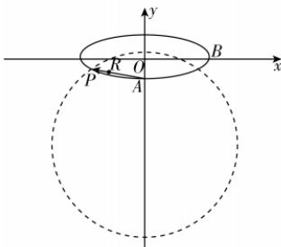

> [!faq]- 答案与解析
>
> > [!success]- **【答案】** 详见解析
>
> > [!note]- **【解析】**
> > 思路导引 (2)(i) 设 $R(x_0, y_0)$ ，点 $R$ 在射线 $AP$ 上 $\rightarrow \overrightarrow{AP}$ 与 $\overrightarrow{AR}$ 同向共线 $\rightarrow |AP| \cdot |AR| = \overrightarrow{AP} \cdot \overrightarrow{AR} = 3$ $\xrightarrow{k_{AP} = k_{AR}}$ 得出点 $R$ 坐标；
> >
> > (ii) 设点 $Q(x_1, y_1) \xrightarrow{\text{点 } Q \text{ 在椭圆 } C \text{ 上}}$ $\frac{x_1^2}{9} + y_1^2 = 1$ $k_{OR} = 3k_{OP} \xrightarrow{\text{点 } P \text{ 轨迹方程}}$ 点 $P$ 在圆上（除 $y$ 轴上两点） $|PQ|$ 的最大值转化为圆上的点到椭圆上的点的距离的最大值 $\rightarrow$ 圆心到椭圆上的点的距离的最大值 $\rightarrow |PQ|$ 的最大值
> >
> > 【解】(1)由题意知 $\left\{\begin{aligned}\frac{c}{a}&=\frac{2\sqrt{2}}{3},\\ a^{2}&=b^{2}+c^{2},\\ a^{2}&+b^{2}=10,\end{aligned}\right.$ 解得 $\left\{\begin{aligned}a^{2}&=9,\\ b^{2}&=1\text{,故}C\text{的方程为}\frac{x^{2}}{9}+y^{2}=1.\\ c^{2}&=8,\end{aligned}\right.$ (2)(i)由(1)知C的方程为 $\frac{x^{2}}{9}+y^{2}=1$ ，则点A的坐标为(0,-1)，设 $R(x_{0},y_{0})$ ，则 $\overrightarrow{AP}=(m,n+1),\overrightarrow{AR}=(x_{0},y_{0}+1)$ ，因为点R在射线AP上，所以 $\overrightarrow{AP}$ 与 $\overrightarrow{AR}$ 同向共线，所以 $|AP|\cdot|AR|= \overrightarrow{AP}\cdot\overrightarrow{AR}=3$ ， $\rightarrow$ 点悟： $\overrightarrow{AP}\cdot\overrightarrow{AR}=|\overrightarrow{AP}|\cdot|\overrightarrow{AR}|\cos0=|\overrightarrow{AP}|\cdot|\overrightarrow{AR}|$ 所以 $mx_{0}+(n+1)(y_{0}+1)=3$ 因为点P不在y轴上，所以直线AP的斜率存在，所以 $k_{AP}=\frac{n+1}{m}=\frac{y_{0}+1}{x_{0}}=k_{AR}$ ，所以 $y_{0}+1=\frac{x_{0}(n+1)}{m}$ 联立 $\left\{\begin{aligned}mx_{0}+(n+1)(y_{0}+1)&=3,\\ y_{0}+1=\frac{x_{0}(n+1)}{m},\end{aligned}\right.$ 解得 $\left\{\begin{aligned}x_{0}&=\frac{3m}{m^{2}+(n+1)^{2}},\\ y_{0}&=-\frac{(n-2)(n+1)+m^{2}}{m^{2}+(n+1)^{2}},\end{aligned}\right.$ 故R的坐标为 $\left(\frac{3m}{m^{2}+(n+1)^{2}},-\frac{(n-2)(n+1)+m^{2}}{m^{2}+(n+1)^{2}}\right)$ 多种解法 由(1)知A(0,-1)，因为点R在射线AP上，所以 $\exists\lambda>0$ ，使得 $\overrightarrow{AR}=\lambda\overrightarrow{AP}$ ，
> >
> > 所以 $|AP|\cdot|AR|=\lambda\overrightarrow{AP}^{2}=\lambda[m^{2}+(n+1)^{2}]=3$ ，所以 $\lambda=\frac{3}{m^{2}+(n+1)^{2}}$ ，
> >
> > 所以 $\overrightarrow{AR}=\frac{3}{m^{2}+(n+1)^{2}}(m,n+1)=\left(\frac{3m}{m^{2}+(n+1)^{2}},\frac{3(n+1)}{m^{2}+(n+1)^{2}}\right)$ ，
> >
> > 所以 $R\left(\frac{3m}{m^{2}+(n+1)^{2}},-\frac{(n-2)(n+1)+m^{2}}{m^{2}+(n+1)^{2}}\right)$ (ii)由(i)知P(m,n)， $R\left(\frac{3m}{m^{2}+(n+1)^{2}},-\frac{(n-2)(n+1)+m^{2}}{m^{2}+(n+1)^{2}}\right)$ ，
> >
> > 因为直线OR的斜率是直线OP的斜率的3倍，
> >
> > 所以 $-\frac{(n-2)(n+1)+m^{2}}{3m}=\frac{3n}{m}$ ，所以 $m^{2}+(n+4)^{2}=18$ ，
> >
> > 所以点P的轨迹方程为 $m^{2}+(n+4)^{2}=18(m\neq0)$ .
> >
> > 设 $Q(x_{1},y_{1})$ ，因为 $Q$ 是 $C$ 上的动点，所以 $\frac{x_1^2}{9} +y_1^2 = 1.$ 因为点 $P$ 的轨迹方程为 $x^{2} + (y + 4)^{2} = 18(x\neq 0)$ ，所以 $|PQ|$ 的最大值可转化为点 $Q$ 到点 $D(0,$ -4)的距离的最大值再加上 $3\sqrt{2}$ 因为 $|QD| = \sqrt{x_1^2 + (y_1 + 4)^2}$ $= \sqrt{9 - 9y_1^2 + y_1^2 + 8y_1 + 16}$ $= \sqrt{-8y_1^2 + 8y_1 + 25}$ $= \sqrt{-8(y_1 - \frac{1}{2})^2 + 27}$ 所以当 $y_{1} = \frac{1}{2}$ 时， $|QD|$ 取得最大值 $3\sqrt{3}.$ 所以 $|PQ|$ 的最大值为 $3\sqrt{3} +3\sqrt{2}$ 心：设 $Q(3\cos \theta ,\sin \theta)$ ，则 $|DQ|^2 = (3\cos \theta)^2 +(\sin \theta +4)^2 = -8\sin^2\theta+$ $8\sin \theta +25 = -8\left(\sin \theta -\frac{1}{2}\right)^2 +27\leqslant 27$ ，所以 $|DQ|_{\max} = 3\sqrt{3}$ ，从而 $|PQ|_{\max} = 3\sqrt{3}+$ $3\sqrt{2}$
> >
> > 
