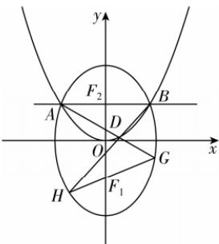

> [!faq]- 答案与解析
>
> > [!success]- **【答案】** 详见解析
>
> > [!note]- **【解析】**
> > 思路导引 (1) 思路一: 设椭圆 C 上任意一点的坐标为 $R(x, y)$ ，根据新定义，旋转后求得对应的点的坐标为 $R'\left(\frac{\sqrt{2}}{2}x - \frac{\sqrt{2}}{2}y, \frac{\sqrt{2}}{2}x + \frac{\sqrt{2}}{2}y\right)$ ，该点在斜椭圆 $\Omega$ 上，代入化简即可得解；思路二: 旋转后，斜椭圆 $\Omega$ 的对称轴为 y = x 和 y = -x，对称轴与曲线 $\Omega$ 的交点之间的距离分别为椭圆 C 的短轴长和长轴长，联立方程求出交点坐标，利用两点间距离公式，分别可以求得 2a 和 2b，从而得解.
> > (2) 不妨设 $M(0,4)$ , $N(0,-4)$ , $T(x,y)$ , $P(x_{1},y_{1})$ ，则 $Q(-x_{1},y_{1})$ ，利用向量法进行求解.
> > (3) 不妨设 A(-3,2), B(3,2), $D\left(x_{0},\frac{2}{9}x_{0}^{2}\right),x_{0}\neq\pm3,G(x_{3},y_{3}),H(x_{4},y_{4})$ ，得出直线 AG 及 BH 的方程，分别联立方程组，进而分析得出定点的坐标.
> > 【解】(1) 设 $R(x, y)$ 为椭圆 C 上任意一点，则 $R'\left(\frac{\sqrt{2}}{2}x-\frac{\sqrt{2}}{2}y,\frac{\sqrt{2}}{2}x+\frac{\sqrt{2}}{2}y\right)$
> >
> > 为斜椭圆 $\Omega$ 上一点，
> > 则 $7\left(\frac{\sqrt{2}}{2}x-\frac{\sqrt{2}}{2}y\right)^{2}+7\left(\frac{\sqrt{2}}{2}x+\frac{\sqrt{2}}{2}y\right)^{2}+2\left(\frac{\sqrt{2}}{2}x-\frac{\sqrt{2}}{2}y\right)\left(\frac{\sqrt{2}}{2}x+\frac{\sqrt{2}}{2}y\right)=96,$ 化简得 $\frac{y^{2}}{16}+\frac{x^{2}}{12}=1$ ，故椭圆 C 的标准方程为 $\frac{y^{2}}{16}+\frac{x^{2}}{12}=1.$ (2) 根据椭圆的对称性，不妨设 $M(0,4)$ ， $N(0,-4)$ ，设 $T(x,y)$ ， $P(x_{1},y_{1})$ ，则 $Q(-x_{1},y_{1})$ ， $\overrightarrow{MT}=(x,y-4),\overrightarrow{MP}=(x_{1},y_{1}-4)$ ，由 P,M,T 三点共线，得 $x(y_{1}-4)=x_{1}(y-4)$ ， $\overrightarrow{NT}=(x,y+4),\overrightarrow{NQ}=(-x_{1},y_{1}+4)$ ，
> > 由 Q,N,T 三点共线，得 $x(y_{1}+4)=-x_{1}(y+4)$ ，则 $y_{1}=\frac{16}{y},x_{1}=\frac{-4x}{y}.$ 因为 $\frac{y_{1}^{2}}{16} + \frac{x_{1}^{2}}{12} = 1$ ，所以 $\frac{16}{y^{2}} + \frac{16x^{2}}{12y^{2}} = 1$ ，即 $\frac{y^{2}}{16}-\frac{x^{2}}{12}=1(y\neq\pm4)$ ，
> > 故点 T 在某定曲线上，该定曲线的方程为 $\frac{y^{2}}{16}-\frac{x^{2}}{12}=1(y\neq\pm4).$ 道坑：求曲线方程时，要注意“补点”和“去点”
> > (3) 根据椭圆的对称性，不妨设 A(-3,2), B(3,2).
> >
> > 
> >
> > 设 $D\left(x_0, \frac{2}{9} x_0^2\right), x_0 \neq \pm 3, G(x_3, y_3), H(x_4, y_4)$ ，则直线 $AG$ 的方程为 $y = \frac{2}{9}(x_0 - 3)x + \frac{2}{3} x_0$ ，直线 $BH$ 的方程为 $y = \frac{2}{9}(x_0 + 3)x - \frac{2}{3} x_0$ .
> >
> > 由 $\left\{\begin{aligned}y&=\frac{2}{9}(x_{0}-3)x+\frac{2}{3}x_{0},\\ \frac{y^{2}}{16}&+\frac{x^{2}}{12}=1\end{aligned}\right.$ 得 $\left[\begin{aligned}1+\\ \frac{1}{27}(x_{0}-3)^{2}\end{aligned}\right]x^{2}+\frac{2}{9}x_{0}(x_{0}-3)x+\frac{1}{3}x_{0}^{2}- \\ 12=0,\\ \text{所以}-3x_{3}=\frac{\frac{1}{3}x_{0}^{2}-12}{1+\frac{1}{27}(x_{0}-3)^{2}},\text{得}x_{3}=&\\ \frac{108-3x_{0}^{2}}{27+(x_{0}-3)^{2}},\text{则}y_{3}=\frac{-2x_{0}^{2}+48x_{0}-72}{27+(x_{0}-3)^{2}}.\\ \text{同理可得}x_{4}=\frac{3x_{0}^{2}-108}{27+(x_{0}+3)^{2}},y_{4}&=&\\ \frac{-2x_{0}^{2}-48x_{0}-72}{27+(x_{0}+3)^{2}}.\\ \text{由对称性知，若过定点，则定点在}y\\ \text{轴上}.\\ \text{取}D(0,0),\text{则}G(3,-2),H(-3,-2),\\ \text{则直线}GH\text{的方程为}y=-2,\\ \text{得定点为}(0,-2).\\ \end{aligned}\right.$
> >
> > 点悟：当定点不易直接求出时，可利用特殊条件判断定点位置，再加以证明下面证明直线 GH 过定点 $(0, -2)$ .
> > 因为 $\frac{y_{3}+2}{x_{3}}=\frac{36x_{0}}{108-3x_{0}^{2}},\quad\frac{y_{4}+2}{x_{4}}=\frac{-36x_{0}}{3x_{0}^{2}-108}$ 所以 $\frac{y_{3}+2}{x_{3}}=\frac{y_{4}+2}{x_{4}}$ ，所以直线GH过定点 $(0,-2)$ .
> >
> > 多种解法 (1)由 $\left\{ \begin{array}{l}7x^{2} + 7y^{2} + 2xy = 96,\\ y = x \end{array} \right.$ 得 $\left\{ \begin{array}{l}x = \sqrt{6},\\ y = \sqrt{6} \end{array} \right.$ 或 $\left\{ \begin{array}{l}x = -\sqrt{6},\\ y = -\sqrt{6}, \end{array} \right.$ 由 $\left\{ \begin{array}{l}7x^{2} + 7y^{2} + 2xy = 96,\\ y = -x \end{array} \right.$ 得 $\left\{ \begin{array}{l}x = 2\sqrt{2},\\ y = -2\sqrt{2} \end{array} \right.$ 或 $\left\{ \begin{array}{l}x = -2\sqrt{2},\\ y = 2\sqrt{2}, \end{array} \right.$ 椭圆 $C$ 的长轴长 $2a =$ $\sqrt{(2\sqrt{2} + 2\sqrt{2})^2 + (-2\sqrt{2} - 2\sqrt{2})^2}$ $= 8$ ，得 $a = 4$ 椭圆 $C$ 的短轴长 $2b =$ $\sqrt{(\sqrt{6} + \sqrt{6})^2 + (\sqrt{6} + \sqrt{6})^2} = 4\sqrt{3}$ ，得 $b = 2\sqrt{3}$ 故椭圆 $C$ 的标准方程为 $\frac{y^2}{16} +\frac{x^2}{12} = 1.$
