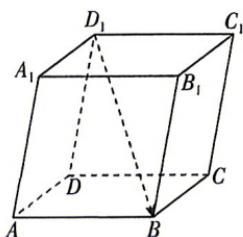

<!-- question-source:start -->
4. 教材 变式 [浙江舟山五校 2026 高二期中联考]
如图, 在平行六面体 $ABCD-A_{1}B_{1}C_{1}D_{1}$ 中, 若 $\overrightarrow{AB}=a, \overrightarrow{AD}=b, \overrightarrow{AA_{1}}=c$ , 则与 $\overrightarrow{D_{1}B}$ 相等的是 ( )

A. $a + b - c$ B. $a - b + c$ C. $a - b - c$ D. $a + b + c$

注：2025 表示 2024\~2025 学年，2026 表示 2025\~2026 学年。

√ 答案 P99
<!-- question-source:end -->

![[Q00071837A1]]
