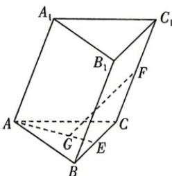

<!-- question-source:start -->
9. 如图, 在三棱柱 $ABC - A_{1}B_{1}C_{1}$ 中, $E, F$ 分别是 $BC, CC_{1}$ 的中点, $G$ 为 $\triangle ABC$ 的重心, 则 $\overrightarrow{GF} =$ ( )

A. $-\frac{1}{3}\overrightarrow{AB} +\frac{2}{3}\overrightarrow{AC} +\frac{1}{2}\overrightarrow{AA_{1}}$ B. $\frac{1}{3}\overrightarrow{AB} +\frac{2}{3}\overrightarrow{AC} +\frac{1}{2}\overrightarrow{AA_{1}}$ C. $-\frac{2}{3}\overrightarrow{AB} +\frac{1}{3}\overrightarrow{AC} -\frac{1}{2}\overrightarrow{AA_{1}}$ D. $\frac{1}{3}\overrightarrow{AB} -\frac{2}{3}\overrightarrow{AC} +\frac{1}{2}\overrightarrow{AA_{1}}$

## 题型4 向量共线、共面的判定及应用
<!-- question-source:end -->

![[Q00071842A1]]
