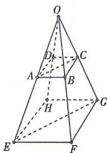

<!-- question-source:start -->
14.[四川绵阳2026高二月考]如图,已知 $\overrightarrow{OE}=k\overrightarrow{OA},\overrightarrow{OF}=k\overrightarrow{OB},\overrightarrow{OH}=k\overrightarrow{OD},\overrightarrow{AC}=\overrightarrow{AD}+m\overrightarrow{AB},\overrightarrow{EG}=\overrightarrow{EH}+m\overrightarrow{EF}$ ,其中 $k,m\in R$ .求证:
(1)A,B,C,D四点共面,E,F,G,H四点共面;

(2) $\overrightarrow{AC}//\overrightarrow{EG};$

(3) $O, G, C$ 三点共线。

## 易错点 共面向量定理理解错误
<!-- question-source:end -->

![[Q00071847A1]]
