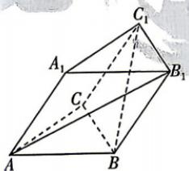

<!-- question-source:start -->
4.[陕西西安中学2026高二月考]在斜三棱柱 $ABC-A_{1}B_{1}C_{1}$ 中,底面边长和侧棱长都为2,且 $\angle BAA_{1}=\angle CAA_{1}=60^{\circ}$ ,则 $\overrightarrow{AB_{1}}\cdot\overrightarrow{BC_{1}}$ 的值为\_\_\_\_.

<!-- question-source:end -->

![[Q00071853A1]]
