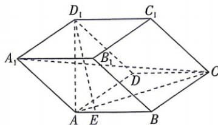

<!-- question-source:start -->
15. 教材 变式 [辽宁沈阳 2026 高二月考] 如图, 四棱柱 $ABCD - A_{1}B_{1}C_{1}D_{1}$ 的所有棱长均为 1, 点 $E$ 满足 $\overrightarrow{AE} = \frac{1}{3}\overrightarrow{EB}$ , 设 $\overrightarrow{AB} = a$ , $\overrightarrow{AD} = b$ , $\overrightarrow{AA_{1}} = c$ .

涓涓细流一旦停止了喧哗，浩浩大海也就终止了呼吸。

(1)用 $a, b, c$ 表示 $\overrightarrow{A_1C}, \overrightarrow{D_1E}$ ;

(2) 若 $AC = AD_{1} = \sqrt{2}$ , $\overrightarrow{AC} \cdot \overrightarrow{AD_{1}} = \frac{1}{2}$ , 求 $|2a + c|$ 与 $D_{1}E$ 的值.

## 题型6 投影向量
<!-- question-source:end -->

![[Q00071864A1]]
