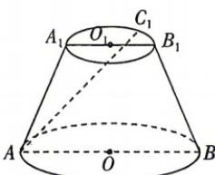
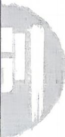

<!-- question-source:start -->
18. 如图, $A_{1}B_{1}, AB$ 分别是圆台上、下底面的两条直径, 且 $AB = 2A_{1}B_{1}, AB \parallel A_{1}B_{1}, C_{1}$ 是弧 $A_{1}B_{1}$ 上靠近点 $B_{1}$ 的

三等分点,则 $\overrightarrow{AC_{1}}$ 在 $\overrightarrow{AB}$ 上的投影向量是
( )
A. $\frac{5}{4}\overrightarrow{AB}$ B. $\frac{5}{6}\overrightarrow{AB}$ C. $\frac{5}{8}\overrightarrow{AB}$ D. $\frac{2}{3}\overrightarrow{AB}$

## 刷提升

▶空间向量数量积的运算 1、4

▶数量积运算的综合应用 3、5、6、7(狂 K-P4 拓展 3)
<!-- question-source:end -->

![[Q00071867A1]]
