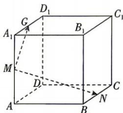

<!-- question-source:start -->
7. 如图, 已知正方体 $ABCD - A_{1}B_{1}C_{1}D_{1}$ 的棱长为 $4, M, N, G$ 分别是棱 $AA_{1}, BC, A_{1}D_{1}$ 的中点, 设 $Q$ 是该正方体表面上的一点, 若 $\overrightarrow{MQ} = x\overrightarrow{MG} + y\overrightarrow{MN}(x, y \in \mathbb{R})$ .

(1) 求点 $Q$ 的轨迹围成图形的面积；

(2) 求 $\overrightarrow{MG} \cdot \overrightarrow{MQ}$ 的最大值.

## 刷素养
<!-- question-source:end -->

![[Q00071874A1]]
