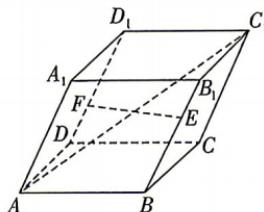

<!-- question-source:start -->
7. 如图, 平行六面体 $ABCD - A_{1}B_{1}C_{1}D_{1}$ 的所有棱长均为 2, AB, AD, $AA_{1}$ 两两所成夹角均为 $\frac{\pi}{3}$ , 点

E,F 分别在棱 $BB_{1}, DD_{1}$ 上,且 $BE = 2B_{1}E$ , $D_{1}F=2DF$ , 则 $\left|\overrightarrow{EF}\right|=\underline{\hspace{2cm}}$ ; 直线 $AC_{1}$ 与 EF 所成角的余弦值为 \_\_\_\_.
<!-- question-source:end -->

![[Q00071882A1]]
