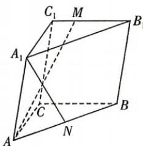

<!-- question-source:start -->
8.[山东多校2025高二期中]如图,N是三棱柱 $ABC-A_{1}B_{1}C_{1}$ 的棱AB的中点.
(1)若 $\overrightarrow{A_{1}N}=x\overrightarrow{CA}+y\overrightarrow{C_{1}B_{1}}+z\overrightarrow{AA_{1}}(x,y,z\in\mathbf{R})$ ，求 $x+y+z$ 的值；
(2) 若 $CA = CB = CC_{1}, \angle ACB = 120^{\circ}, CC_{1} \perp$ 平面 ABC，点 M 在棱 $C_{1}B_{1}$ 上， $AM \perp A_{1}N$ ，求 $\frac{C_{1}M}{MB_{1}}$ 的值.

## 1.3.1 空间直角坐标系 + 1.3.2 空间向量运算的坐标表示刷基础

视频讲解

错题本

√ 答案 P104

## 题型1 空间向量的坐标表示
<!-- question-source:end -->

![[Q00071883A1]]
