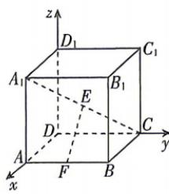

<!-- question-source:start -->
10. 如图, 在空间直角坐标系中, 有一棱长为 2 的正方体 $ABCD-A_{1}B_{1}C_{1}D_{1}$ , 则 $A_{1}C$ 的中点 E 到 AB 的中点 F 的距离为 ( )
A. $2\sqrt{2}$ B. $\sqrt{2}$ C. 2

<!-- question-source:end -->

![[Q00071893A1]]
