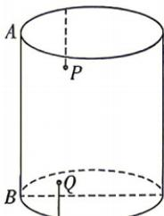

<!-- question-source:start -->
11.[四川成都外国语学校2025高二月考(改编)]现有一段底面周长为 $12\pi$ 厘米和高为15厘米的圆柱形水管,AB是圆柱的母线,两只蚂蚁分别在水管内

壁爬行,一只从点 A 沿上底部圆弧顺时针方向爬行 $2\pi$ 厘米后再向下爬行 5 厘米到达点 P, 另一只从点 B 沿下底部圆弧逆时针方向爬行 $2\pi$ 厘米后再向上爬行 4 厘米到达点 Q, 则此时线段 PQ 的长(单位:厘米)为 ( )
A. $6\sqrt{2}$ B. 12
C. $12\sqrt{2}$ D. $12\sqrt{3}$

## 题型5 向量夹角
<!-- question-source:end -->

![[Q00071894A1]]
