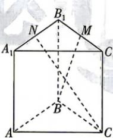

<!-- question-source:start -->
13.[湖北孝感高中2026高二期中]在直三棱柱 $ABC-A_{1}B_{1}C_{1}$ 中, $AB\perp BC,BB_{1}=2\sqrt{2},AB=BC=2,M,N$ 分别是 $B_{1}C_{1}$ , $A_{1}B_{1}$ 的中点,则直线BM与直线CN所成角的余弦值为
A. $\frac{2\sqrt{13}}{13}$ B. $\frac{\sqrt{13}}{13}$ C. $\frac{\sqrt{5}}{5}$

线 $CN$ 所成角的余弦值为 （ ）A. $\frac{2\sqrt{13}}{13}$ B. $\frac{\sqrt{13}}{13}$ C. $\frac{\sqrt{5}}{5}$ D. $\frac{2\sqrt{5}}{15}$

## 题型6 向量的平行与垂直
<!-- question-source:end -->

![[Q00071896A1]]
