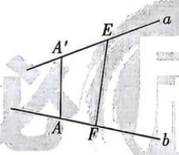

<!-- question-source:start -->
3. 教材 变式 [江苏无锡 2026 高二期中] 如图, 两条异面直线 $a, b$ 所成的角为 $60^{\circ}$ , 在直线 $a, b$ 上分别取点 $A', E$ 和点

错题本

A, F, 使 $AA' \perp a$ 且 $AA' \perp b$ . 已知 $A'E = 2, AF = 3, EF = \sqrt{23}$ . 则线段 $AA'$ 的长为 ( )
A. 2 或 $\sqrt{10}$ B. 4
C. 2 或 4 D. 4 或 $\sqrt{10}$
<!-- question-source:end -->

![[Q00071906A1]]
