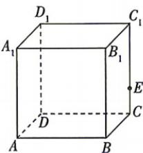

<!-- question-source:start -->
2. (多选)如图, 在正方体 $ABCD-A_{1}B_{1}C_{1}D_{1}$ 中, $E$ 为棱 $CC_{1}$ 上不与 $C_{1}, C$ 重合的任意一点, 则能作为直线 $AA_{1}$ 的方向向量的是
( )
A. $\overrightarrow{AA_{1}}$ B. $\overrightarrow{C_{1}E}$ C. $\overrightarrow{AB}$ D. $\overrightarrow{A_{1}A}$

<!-- question-source:end -->

![[Q00071916A1]]
