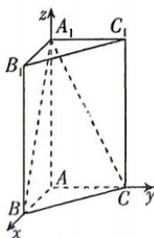

<!-- question-source:start -->
5. 教材 变式 (多选) [江西宜春 2026 高二月考] 如图, 在直三棱柱 $ABC - A_{1}B_{1}C_{1}$ 中, $AB \perp AC$ , $AB = AC = 1, AA_{1} = 2$ . 以 $A$ 为坐标原点, 建立如图所示空间直角坐标系. 以下向量可成为平面 $BCC_{1}B_{1}$ 的法向量的是 ( )

A. $(4, - 4,0)$ B. $(-3,3,0)$ C. $(-2, - 2,0)$ D. $(1,1,0)$

√ 答案 P108
<!-- question-source:end -->

![[Q00071919A1]]
