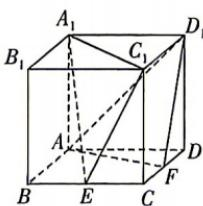

<!-- question-source:start -->
5. 如图, 在正方体 $ABCD-A_{1}B_{1}C_{1}D_{1}$ 中, E, F 分别为 BC, CD 的中点, 则 ( )

为 $BC, CD$ 的中点，则
A. $AF \parallel$ 平面 $A_{1}EC_{1}$ B. $D_{1}F \parallel$ 平面 $A_{1}EC_{1}$ C. $A_{1}C_{1} \parallel$ 平面 $AFD_{1}$ D. $A_{1}E \parallel$ 平面 $AFD_{1}$

## 题型2 垂直关系的判定与应用
<!-- question-source:end -->

![[Q00071927A1]]
