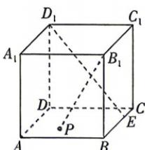

<!-- question-source:start -->
9.[湖北黄冈2026高二段考]如图,在棱长为3的正方体 $ABCD-A_{1}B_{1}C_{1}D_{1}$ 中, $\overrightarrow{BC}=3\overrightarrow{EC}$ ,点P在底面ABCD(包含

边界)上移动,且满足 $B_{1}P\perp D_{1}E$ ,则线段 $B_{1}P$ 的长度的最大值为\_\_\_\_.
<!-- question-source:end -->

![[Q00071931A1]]
