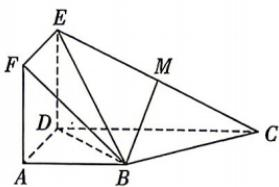

<!-- question-source:start -->
10. [安徽六安 2025 高二期中] 如图, 正方形 ADEF 与梯形 ABCD 所在的平面互相垂直, $AD \perp CD, AB \parallel CD, AB = AD = 2, CD = 4, M$ 为 CE 的中点.

(1) 求证: BM//平面 ADEF;

(2) 求证: $BC \perp$ 平面 BDE.

<!-- question-source:end -->

![[Q00071932A1]]
