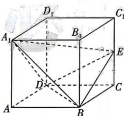

<!-- question-source:start -->
11.[陕西咸阳2026高二月考]如图,已知正方体 $ABCD-A_{1}B_{1}C_{1}D_{1}$ 中,E为棱 $CC_{1}$ 上的动点.
(1) 求证: $A_{1}E \perp BD$ ;
(2) 若平面 $A_{1}BD \perp$ 平面 EBD, 求证: E 为 $CC_{1}$ 的中点.

## 题型3 空间线面位置关系的探索性问题
<!-- question-source:end -->

![[Q00071933A1]]
