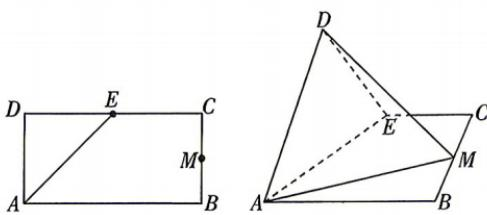

<!-- question-source:start -->
12. 教材 变式 [江苏南菁高级中学 2026 高二期中] 已知矩形 ABCD 中, AB = 4, AD = 2, E 为 CD 的中点, 沿 AE 折成直二面角, M 为 BC 的中点.
(1) 求证: $BC \perp DM$ .
(2) 在棱 DE 上是否存在点 N, 使得 CN// 平面 ADM? 若存在, 求 $\frac{EN}{ND}$ 的值; 若不存在, 请说明理由.

<!-- question-source:end -->

![[Q00071934A1]]
