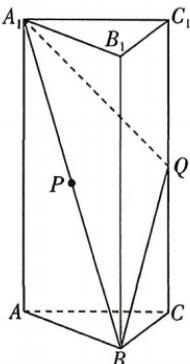

<!-- question-source:start -->
13.[陕西渭南2026高二质检]如图,在直三棱柱 $ABC-A_{1}B_{1}C_{1}$ 中, $CA=CB=\frac{1}{2}AA_{1}=1,BC\perp AC,P$ 为线段 $A_{1}B$ 上的动点,Q为棱 $C_{1}C$ 的中点.
(1)设平面 $A_{1}BQ\cap$ 平面ABC=l,若P为线段 $A_{1}B$ 的中点,求证: $PQ//l$ .
(2)设 $\overrightarrow{BP}=\lambda\overrightarrow{BA_{1}}$ ,在线段 $A_{1}B$ 上是否存在点P,使得AP⊥平面 $A_{1}BQ$ ?若存在,求出实数 $\lambda$ 的值;若不存在,请说明理由.

# 1.4.2 用空间向量研究距离、夹角问题课时① 用空间向量研究距离问题

视频讲解

## 刷基础

错题本

答案 P110

## 题型1 用空间向量研究点线距
<!-- question-source:end -->

![[Q00071935A1]]
