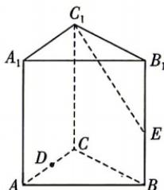
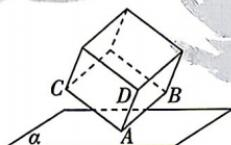

<!-- question-source:start -->
3.[辽宁部分学校2025高二期中]如图,在直三棱柱ABC-A₁B₁C₁中,∠ACB=π/2,AC=2,BC=1,AA₁=2,点D是棱AC

的中点, 点 E 在棱 $BB_{1}$ 上运动, 则点 D 到直线 $C_{1}E$ 的距离的最小值为 ( )
A. $\frac{3\sqrt{5}}{5}$ B. $\frac{4\sqrt{5}}{5}$ C. $\sqrt{5}$ D. $\frac{5\sqrt{5}}{4}$

<!-- question-source:end -->

![[Q00071948A1]]
