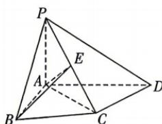

<!-- question-source:start -->
8.[河南洛阳2025高二期中]如图,在四棱锥P-ABCD中, $\triangle ABC$ 为正三角形, $AB\perp AD$ , $AC\perp CD$ , $PA\perp$ 平面ABCD,PC与平面ABCD所成角为45°.

(1) 若 E 为 PC 的中点, 求证: $PD \perp$ 平面 ABE;
(2) 若 $CD = \sqrt{3}$ ，求点 B 到平面 PCD 的距离.

## 刷素养
<!-- question-source:end -->

![[Q00071953A1]]
