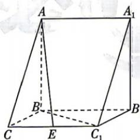

<!-- question-source:start -->
3.[北京海淀区2026高二期中]如图,在三棱柱 $ABC-A_{1}B_{1}C_{1}$ 中, $AB\perp$ 平面 $BB_{1}C_{1}C$ ,已知 $\angle BCC_{1}=\frac{\pi}{3},BC=1,AB=C_{1}C=2$ ,点E是棱 $CC_{1}$ 的中点.

(1) 求证: $BC_{1} \perp$ 平面 $ABC$ ;

(2) 求异面直线 $BC_{1}$ 与 AE 所成角的余弦值.

答案P114

## 题型2 用空间向量研究线面角
<!-- question-source:end -->

![[Q00071956A1]]
