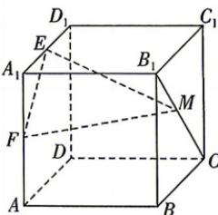

<!-- question-source:start -->
6.[河南许昌2025高二联考]如图,在正方体ABCD-A₁B₁C₁D₁中,E为A₁D₁的中点,F为AA₁的中点,M在线段B₁C上,则直线DD₁与

平面MEF所成角的最大值为 （ ）A. $\frac{\pi}{2}$ B. $\frac{\pi}{3}$ C. $\frac{\pi}{4}$ D. $\frac{\pi}{6}$
<!-- question-source:end -->

![[Q00071959A1]]
