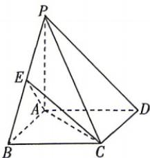

<!-- question-source:start -->
7.[安徽淮南2026高二月考]如图,在四棱锥P-ABCD中, $PA\perp$ 底面ABCD,底面ABCD为矩形, $AB=AD=\frac{\sqrt{2}}{2}PD=2$ ,点E在棱PB上,且直线PD与CE所成的角为 $\frac{\pi}{6}$ .
【更多资料关注公众号：瀚升学堂】
(1)证明:点E为棱PB的中点;

(2) 求直线 $CD$ 与平面 $ACE$ 所成角的正弦值.

## 题型3 用空间向量研究二面角或面面角
<!-- question-source:end -->

![[Q00071960A1]]
