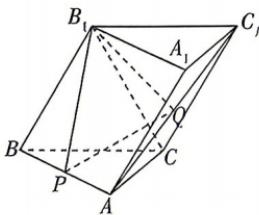

<!-- question-source:start -->
11.[天津东丽区2026高二期中]如图,在三棱柱 $ABC-A_{1}B_{1}C_{1}$ 中,P,Q分别是AB, $AC_{1}$ 的中点,平面 $B_{1}BCC_{1}\perp$ 平面ABC, $AC\perp BC$ , $\triangle B_{1}BC$ 为等边三角形,CB=2CA=4.
(1) 求证: PQ//平面 $BCC_{1}B_{1}$ ;
(2) 求平面 $BCC_{1}B_{1}$ 与平面 $B_{1}PQ$ 夹角的余弦值.

## 刷易错

## 易错点 忽视向量的夹角与空间角的范围及关系而致错
<!-- question-source:end -->

![[Q00071964A1]]
