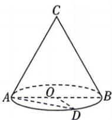

<!-- question-source:start -->
2.[四川成都石室中学2026高二期中]如图,已知圆锥CO的轴截面CAB是正三角形,AB是底面圆O的直径,点D在 $\widehat{AB}$ 上,且 $\angle AOD=2\angle BOD$ ,则异面直线AD与BC所成角的余弦值为()

A. $\frac{\sqrt{3}}{4}$ B. $\frac{1}{2}$ C. $\frac{1}{4}$ D. $\frac{3}{4}$
<!-- question-source:end -->

![[Q00071968A1]]
