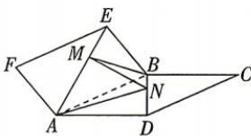

<!-- question-source:start -->
6.[辽宁省实验中学2026高二月考]如图,在正方形ABCD,ABEF中, $\angle CBE=120^{\circ}$ ,动点M,N分别在AE和DB上,EM=BN,当 $|\overrightarrow{MN}|$ 最小时,二面角A-MN-B的余弦值是()

A. $-\frac{\sqrt{2}}{2}$ B. $-\frac{\sqrt{3}}{2}$ C. $-\frac{3}{5}$ D. $-\frac{4}{5}$
<!-- question-source:end -->

![[Q00071972A1]]
