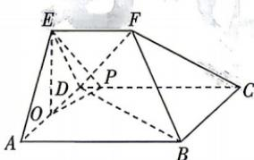

<!-- question-source:start -->
9.[北京顺义区2026高二月考]我国古代著作《九章算术》中记载了一种几何体“刍甍”，中国传统房屋的顶部大多是“刍甍”，如图所示的五面体为一个“刍甍”，其六个顶点分别为A,B,C,D,E,F.四边形ABCD为矩形，AB=2AD=2EF=4, $\overrightarrow{DP}=\frac{1}{8}\overrightarrow{DC}$ ,EA=ED,O为AD的中点，平面 $EAD\perp$ 平面ABCD.
(1) 求证: $BD \perp$ 平面 OEP;
(2) 若平面 $EAD \cap$ 平面 FBC = m，且 m 与直线 AE 所成角为 $45^{\circ}$ ，求二面角 D - BF - C 的余弦值.

<!-- question-source:end -->

![[Q00071975A1]]
