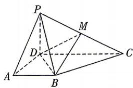

<!-- question-source:start -->
10.[福建三明一中2025高二月考]如图,在四棱锥P-ABCD中,平面PDC⊥平面ABCD, $AD \perp CD, AB \parallel CD, AB = \frac{1}{2}CD = AD = 1, M$ 为棱
PC的中点.
(1)证明:BM//平面PAD.
(2)若 $PC=\sqrt{5},PD=1$ ,
(i)求二面角P-DM-B的余弦值.
(ii)在线段PA上是否存在点Q,使得点Q到
平面BDM的距离是 $\frac{2\sqrt{6}}{9}$ ?若存在,求出PQ
的值;若不存在,说明理由.

视频讲解

错题本

## 刷能力
<!-- question-source:end -->

![[Q00071976A1]]
