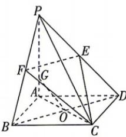

<!-- question-source:start -->
2.[福建南安2026高二期中]如图,在四棱锥P-ABCD中, $PA\perp$ 平面ABCD,底面ABCD是正方形,E,F分别为PD,PB的中点,点G在线段AP

上,AC与BD交于点O,PA=AB=2,若OG//平面EFC,则AG=
A. $\frac{1}{3}$ B. $\frac{1}{2}$ C. $\frac{3}{4}$ D. $\frac{2}{3}$
<!-- question-source:end -->

![[Q00071978A1]]
