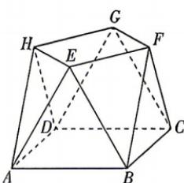

<!-- question-source:start -->
5.[北京海淀农大附中2026高二期中]小明同学设计了一个封闭的包装盒,包装盒如图所示.已知底面ABCD是边长为20(单位:cm)的正方

形, $\triangle EAB,\triangle FBC,\triangle GCD,\triangle HDA$ 均为正三角形,且它们所在的平面都与平面ABCD垂直.则知识能使人的眼睛更加明亮;理想能使人的心灵更加美好。

建议用时:60 分钟 答案 P120

下列三个结论中,正确的是 ( )
① $\overrightarrow{EH}\cdot\overrightarrow{BF}=100$ ;
②该包装盒的容积(不计包装盒材料的厚度)
为 $\frac{8\ 000\sqrt{3}}{3}$ cm $^{3}$ ;
③包装盒的上底面 HEFG 与一个侧面 AHE 构
成的二面角 A-HE-F 的余弦值为 $-\frac{\sqrt{7}}{7}$ .
A. ①③ B. ②③ C. ①② D. ①②③
<!-- question-source:end -->

![[Q00071981A1]]
