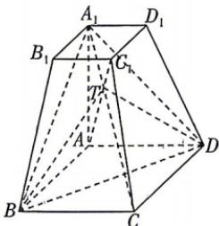

<!-- question-source:start -->
8.[吉林省吉林一中2026高二月考]已知四棱台 $ABCD-A_{1}B_{1}C_{1}D_{1},AB=AA_{1}=2A_{1}B_{1}=2$ ，底面四边形ABCD为菱形， $\angle ABC=\frac{\pi}{3}$ ，且侧棱 $AA_{1}\perp$ 平面ABCD.

(1) 证明: $CC_{1} \parallel$ 平面 $A_{1}BD$ ;

(2) 记 $AC_{1} \cap A_{1}C = T$ ，求直线 $AA_{1}$ 与平面 TBD 所成角的正弦值.

<!-- question-source:end -->

![[Q00071984A1]]
