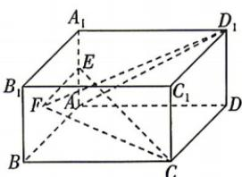

<!-- question-source:start -->
2. (多选) [四川自贡 2026 高二月考] 如图, 在长方体 $ABCD - A_{1}B_{1}C_{1}D_{1}$ 中, $AB = AD = 2AA_{1} = 4$ , 点 $E$ 为 $AA_{1}$ 的中点, 点 $F$ 为侧面 $AA_{1}B_{1}B$ (含边界)上的动点, 则下列说法正确的是 ( )

A. 存在点 F, 使得 $FC \perp FD_{1}$ B. 满足 $FC = FD_{1}$ 的点 F 的轨迹长度为 $\sqrt{5}$ C. $FC + FD_{1}$ 的最小值为 $4\sqrt{2} + 2\sqrt{5}$ D. 若 $AD_{1} \parallel$ 平面 EFC，则线段 AF 长度的最小值为 $\frac{4}{5}$
<!-- question-source:end -->

![[Q00071988A1]]
