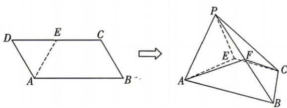

<!-- question-source:start -->
4.[黑龙江哈尔滨九中2025高二期末]如图,在平行四边形ABCD中, $AB=2BC=2,\angle ABC=60^{\circ},E$ 为CD的中点,沿AE将 $\triangle DAE$ 翻折至 $\triangle PAE$ 的位置,得到四棱锥P-ABCE,F为线段PB上一动点.
(1)若F为PB的中点,证明:在翻折过程中均有CF//平面PAE.
(2)若PB=2,
①证明:平面PAE⊥平面ABCE;
②当动点F到平面PCE的距离为 $\frac{\sqrt{15}}{10}$ 时,求 $\frac{PF}{PB}$ 的值.

错题本

## 刷速度

## 一、单项选择题: 本大题共 8 小题, 每小题 5 分, 共 40 分. 在每小题给出的四个选项中, 只有一项是符合题目要求的.
<!-- question-source:end -->

![[Q00071990A1]]
